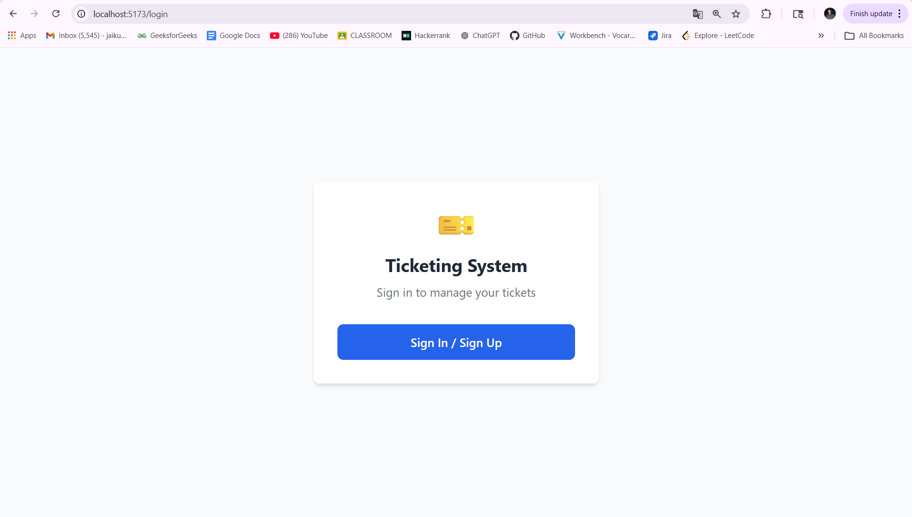
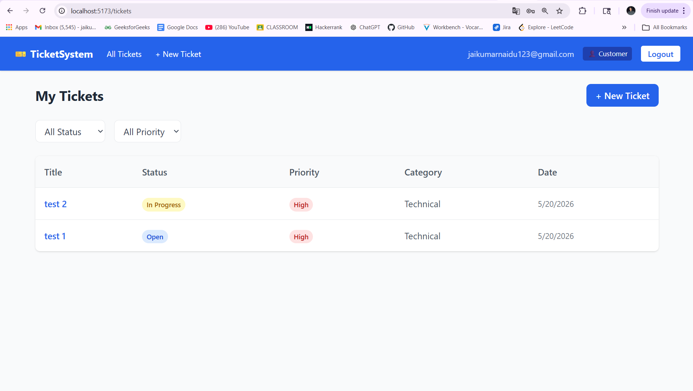
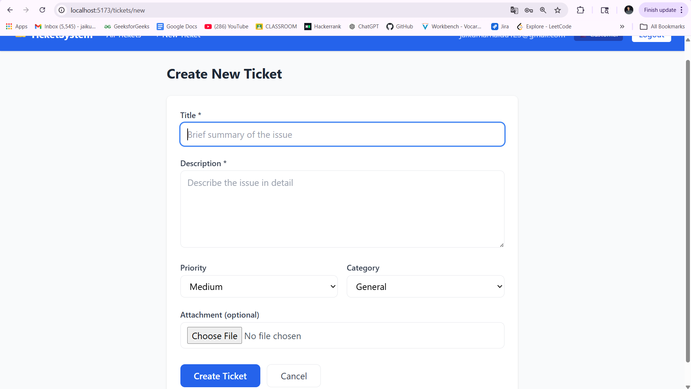
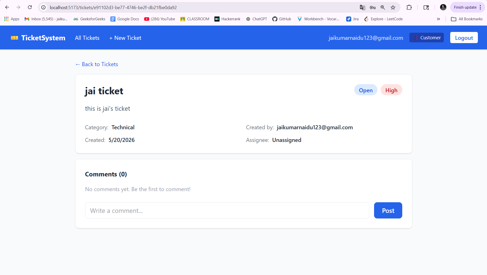
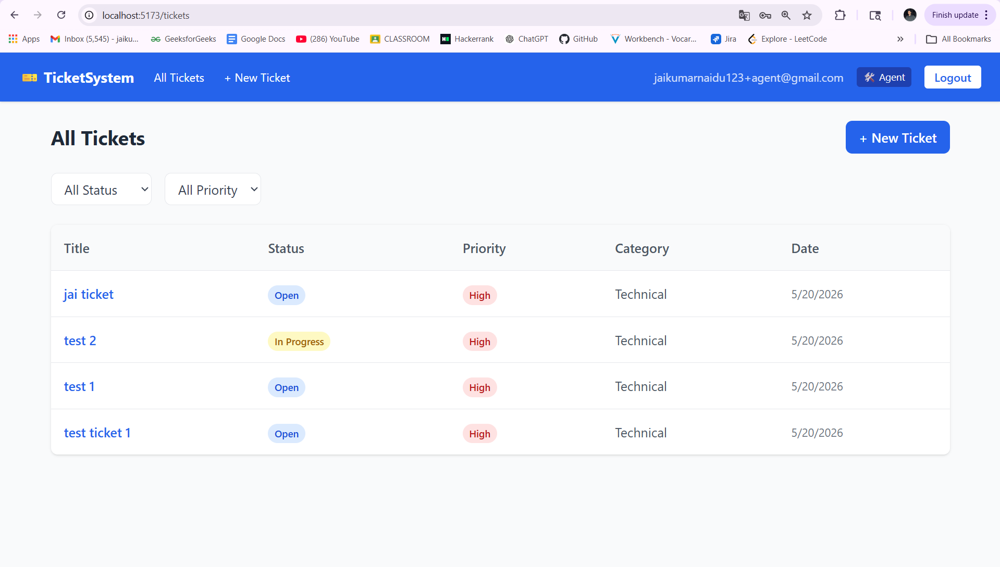
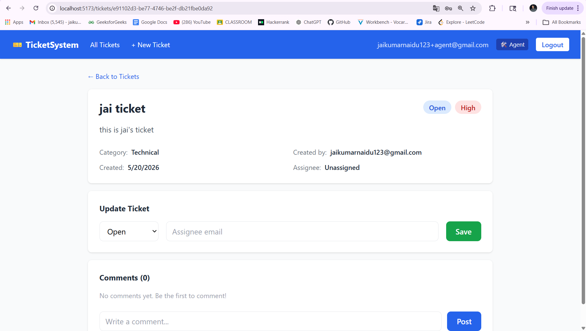

# 🎫 AWS Serverless Ticketing System

A fully functional serverless ticketing system built using Vue.js and
AWS cloud services, designed as a proof-of-concept project running
completely on the AWS Free Tier. The application enables customers and
support agents to create, manage, track, and resolve support tickets
through a secure and scalable architecture. It uses AWS Lambda for
backend processing, Cognito for authentication and authorization,
DynamoDB for storage, and S3 for file handling. The project demonstrates
a complete end-to-end cloud-native workflow using modern frontend and
serverless backend technologies. The system is role-based, highly
modular, and follows a scalable API-driven design.

## 🚀 Test Accounts

  Role       Email                              Password
  ---------- ---------------------------------- ---------------
  Customer   jaikumarnaidu123@gmail.com         Chintujay@123
  Agent      jaikumarnaidu123+agent@gmail.com   Chintujay@123

------------------------------------------------------------------------

## 📸 Screenshots

### 1. Login Screen


### 2. Customer - My Tickets


### 3. Create New Ticket


### 4. Ticket Detail & Comments


### 5. Agent - All Tickets


### 6. Agent - Update Ticket


---

## ✅ Features Implemented

### Authentication

-   ✅ User Sign-up & Sign-in via Amazon Cognito Hosted UI
-   ✅ Two roles: Customer and Agent
-   ✅ Protected routes in Vue.js
-   ✅ JWT token-based API authorization

### Ticket Management

-   ✅ Create new ticket with Title, Description, Priority, Category
-   ✅ File attachment support via S3 pre-signed URLs
-   ✅ List & filter tickets by Status and Priority
-   ✅ View ticket details with activity timeline
-   ✅ Update ticket status & assignee (Agent only)
-   ✅ Add comments on tickets

### Access Control

-   ✅ Customers see only their own tickets
-   ✅ Agents see all tickets from all customers
-   ✅ Only agents can update ticket status and assignee

------------------------------------------------------------------------

## 🛠️ Tech Stack

  Layer            Technology
  ---------------- -----------------------------
  Frontend         Vue 3 + Vite + Tailwind CSS
  Backend          AWS Lambda (Node.js)
  API              AWS API Gateway (HTTP API)
  Database         Amazon DynamoDB
  Authentication   Amazon Cognito
  File Storage     Amazon S3

------------------------------------------------------------------------

## ☁️ AWS Services Used

-   AWS Lambda
-   Amazon API Gateway
-   Amazon Cognito
-   Amazon DynamoDB
-   Amazon S3
-   AWS IAM
-   Amazon CloudWatch

------------------------------------------------------------------------

## 📋 API Endpoints

  Method   Endpoint                         Description
  -------- -------------------------------- ------------------------
  POST     `/tickets`                       Create a new ticket
  GET      `/tickets`                       List tickets
  GET      `/tickets/{ticketId}`            Get ticket details
  PUT      `/tickets/{ticketId}`            Update ticket
  POST     `/tickets/{ticketId}/comments`   Add comment
  GET      `/tickets/{ticketId}/comments`   Get comments
  POST     `/tickets/presigned-url`         Generate S3 upload URL

All endpoints are protected using Amazon Cognito JWT Authorizers.

------------------------------------------------------------------------

## 🏗️ Architecture

    Vue.js Frontend (Vite + Tailwind)
                │
                ▼
    API Gateway (HTTP API)
                │
                ▼
    AWS Lambda Functions
     ├── ticketing-create
     ├── ticketing-list
     ├── ticketing-get
     ├── ticketing-update
     ├── ticketing-add-comment
     ├── ticketing-get-comments
     └── ticketing-presigned
                │
                ├── Amazon DynamoDB
                ├── Amazon S3
                └── Amazon Cognito

------------------------------------------------------------------------

## 📁 Project Structure

``` bash
aws-ticketing-system/
│
├── frontend/
│   ├── src/
│   │   ├── api/
│   │   ├── components/
│   │   ├── router/
│   │   ├── stores/
│   │   └── views/
│   │
│   ├── .env
│   └── package.json
│
├── backend/
│   ├── handlers/
│   │   ├── tickets.js
│   │   ├── comments.js
│   │   └── presignedUrl.js
│   │
│   └── utils/
│       └── response.js
│
├── screenshots/
│
└── README.md
```

------------------------------------------------------------------------

## ⚙️ Local Setup

### Prerequisites

-   Node.js
-   AWS Account (Free Tier)
-   AWS CLI configured

### Clone Repository

``` bash
git clone https://github.com/YOUR_USERNAME/aws-ticketing-system.git

cd aws-ticketing-system
```

### Frontend Setup

``` bash
cd frontend

npm install
```

### Create `.env`

``` env
VITE_COGNITO_DOMAIN=your_cognito_domain
VITE_CLIENT_ID=your_cognito_client_id
VITE_REDIRECT_URI=http://localhost:5173/callback
VITE_API_URL=your_api_gateway_url
```

### Run Frontend

``` bash
npm run dev
```

Open:

``` txt
http://localhost:5173
```

------------------------------------------------------------------------

## ☁️ AWS Free Tier Usage

  Service       Usage         Free Tier
  ------------- ------------- -------------------
  Lambda        7 functions   1M requests/month
  API Gateway   HTTP API      1M requests/month
  DynamoDB      2 tables      25GB
  Cognito       User Pool     50,000 MAUs
  S3            Attachments   5GB

------------------------------------------------------------------------

## 👨‍💻 Author

**Jaikumar Naidu**